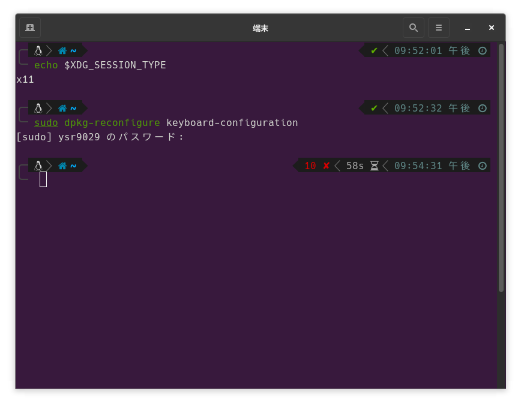
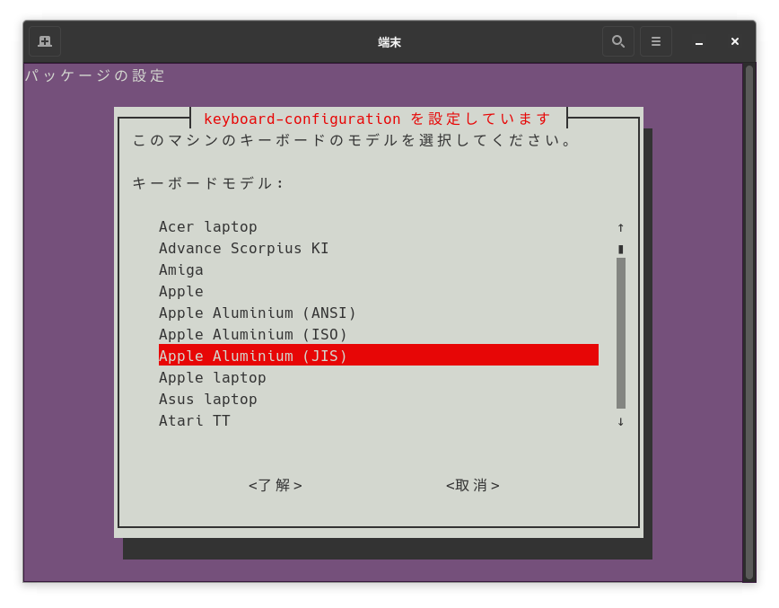
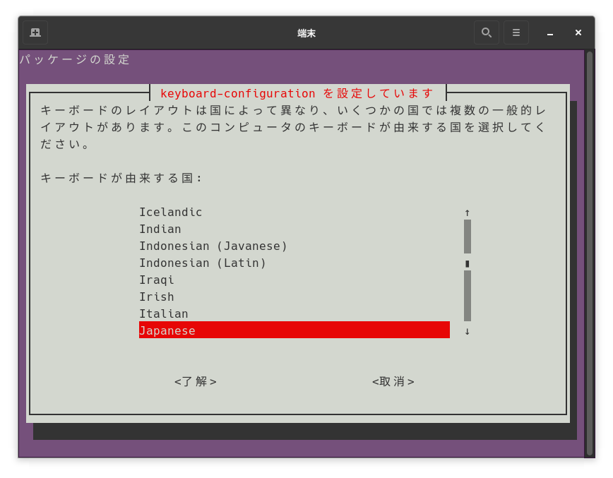
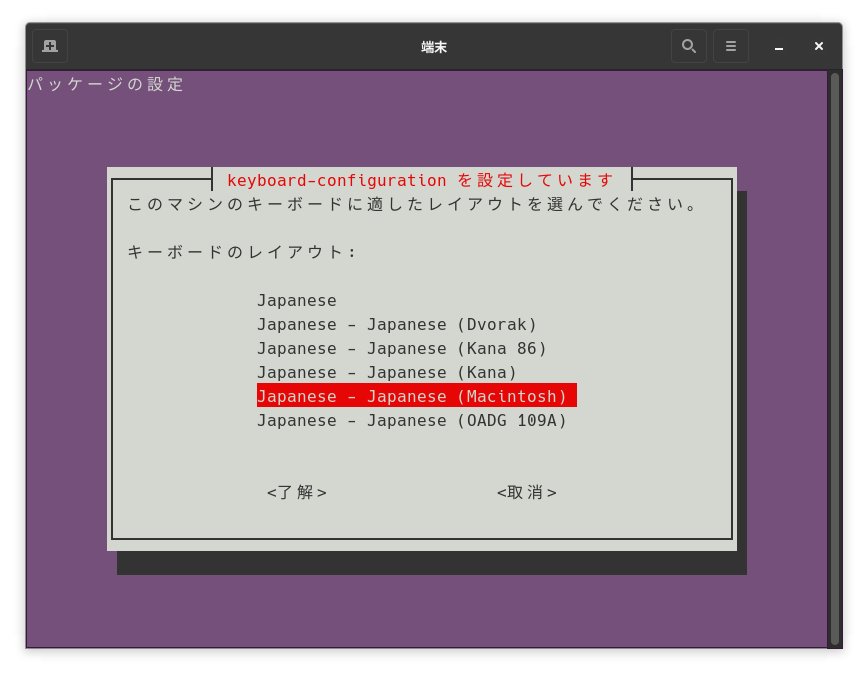
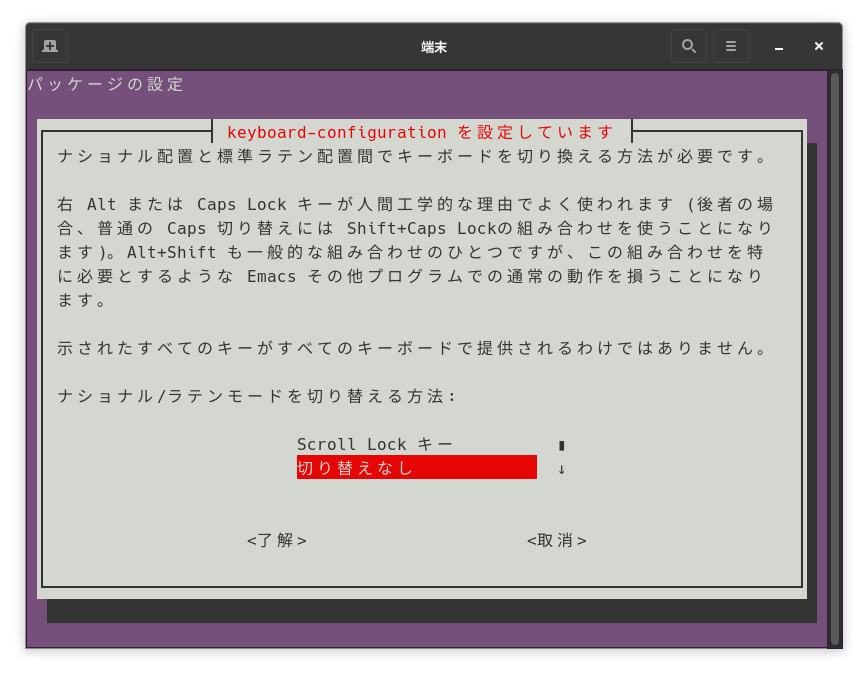
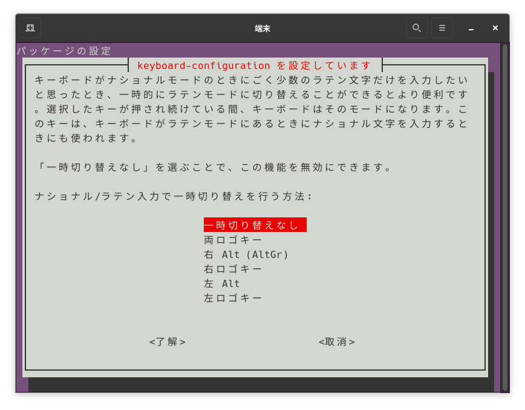
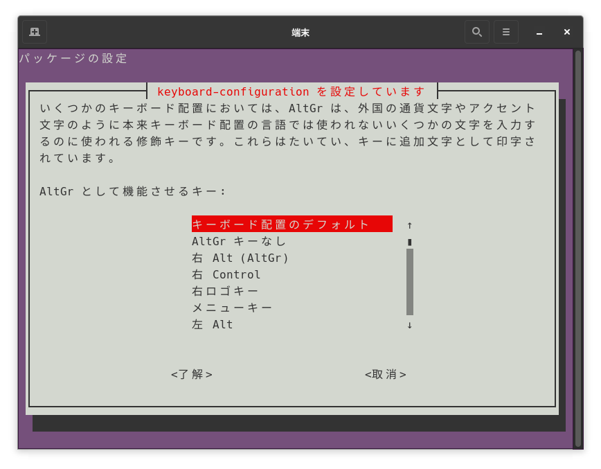
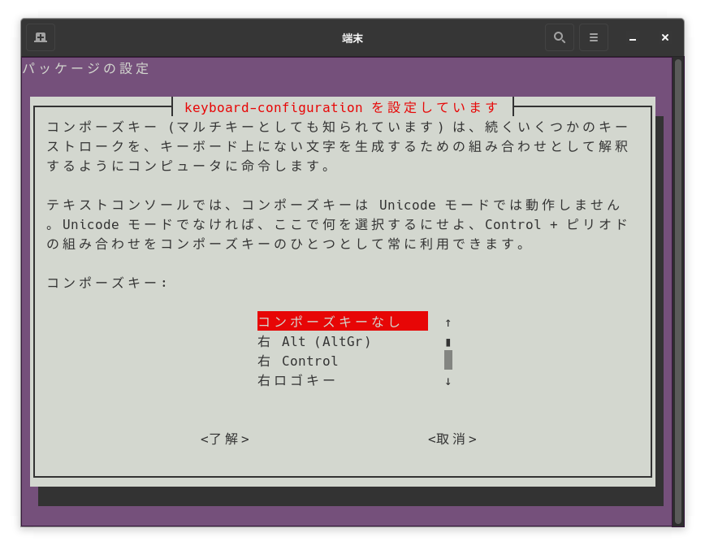
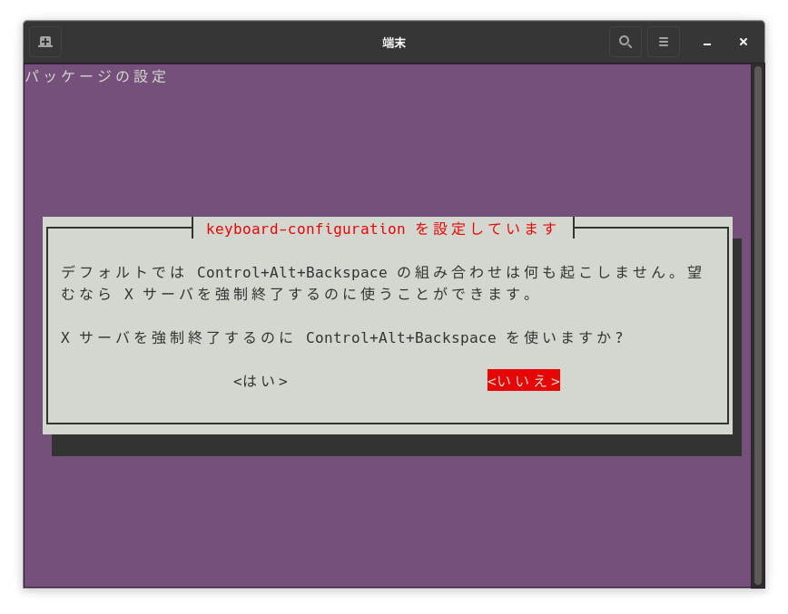

# ✨はじめに
なぜこの記事を書いたかといいますと、MacbookにPop!OSを導入してVoidHack用の記事を書いていましたところ

何故かバッククォート(`)が正常に打てなくていらいらしていたら実はキーボードレイアウトがUS配列だったのが原因でした。

Linux関係は詳しくないのであくまで自分の備忘録として記事に残して置きます。

# 💻環境
端末:Apple Inc. MacBookAir7,2

OS:Pop!_OS 22.04 LTS x64

X Window System:X11

GNOME:42.5

shell:zsh 5.8.1(gnome-terminal)
## X Windows Systemを確認するには...
```bash
echo $XDG_SESSION_TYPE
# x11 ならばXorgで動作しています
# waylandならばWaylandで動作しています
# 今回はXorgのみで確認しています。
```

# キーボードレイアウトを変更する
ターミナルで下記コマンドを実行します。
```bash
sudo dpkg-reconfigure keyboard-configuration
```


そうすると下記のようなモデルの選択画面に遷移します。

今回は`JISキーボード`を使用しているため`Apple Aluminium（JIS）`を選択しています。


次に進むと国設定に移動しますので`Japanese`を選択して進みます。


そうするとキーボードレイアウトを選択する画面に遷移するので`Japanese（Macintosh）`を選択します。


これ以降はナショナル/ラテンモードの切り替え・一時切り替えを有効にするか質問されますが、

いずれも切り替えなしを選択します。



AltGrとして機能させるキーの設定:`キーボード配置のデフォルト`


コンポーズキー:`コンポーズキーなし`


Xサーバーの強制に<kbd>Control</kbd>+<kbd>Alt</kbd>+<kbd>Backspace</kbd>を使うか:`いいえ`


いいえを選択後は自動的にターミナルへ遷移し設定が終われば操作は終了です。
あとは`reboot`コマンド等を用いて端末を再起動しましょう。

:::danger
再起動を行わないと**設定が反映されないので必ず再起動を行いましょう。**
:::

# まとめ
以上でキーボードレイアウトの変更が出来たかと思います。
キーボード設定からキーボードレイアウトの表示を行ってキーボード刻印と相違がなければ問題ありません。
またMozcの日本語切り替えは「かな」キーで切り替えが可能です。